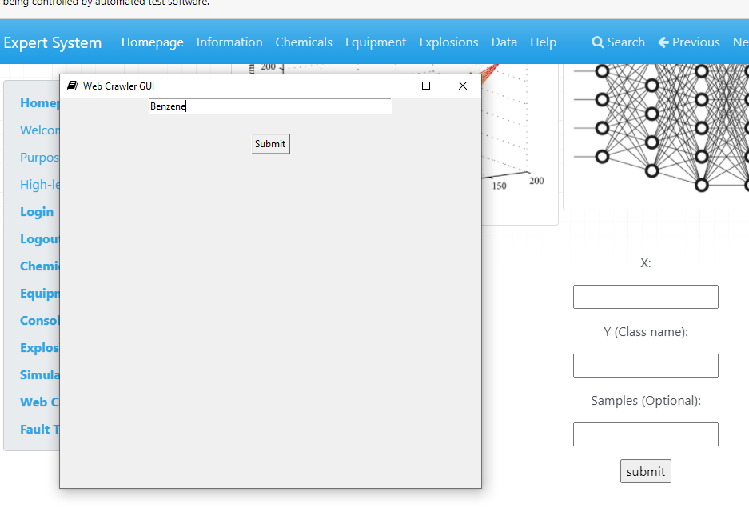
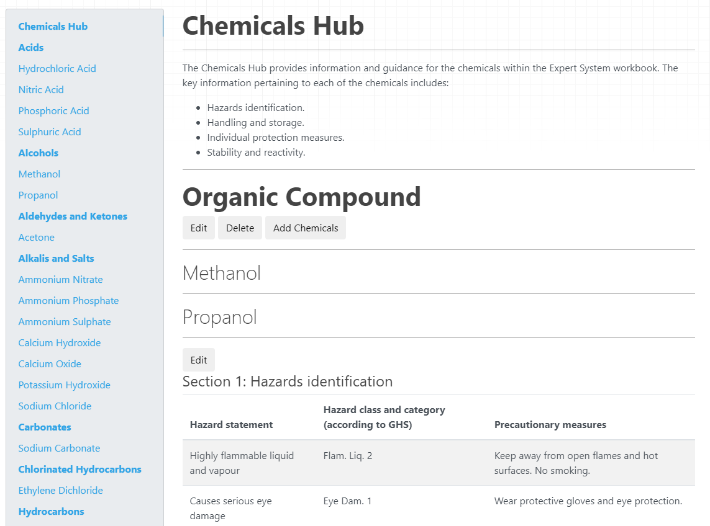

# Expert System
An application for data driven Hazop automation

This software was developed to extend the functionality of the [expert system](https://github.com/harryhitchman/expertsystem), to make the static website dynamic and allow the user to edit information directly from the webpage. This was done for a summer research project described [here](Expert_System.pdf)
---
### New features include:
1. **Explosions Hub** 
This hub is used to inform the user regarding various design standards and suggest effective powder handling practices and design considerations in accordance with HSE and English standards and regulations. 

This Hub can be consulted by new personnel or unexperienced staff members when assessing the risk of their area of interest.
1. **Tests Hub** 
This hub was developed to also provide guidance on common practices however this will list relevant tests that the user can carry out to obtain data and better characterise their hazardous operations
1. **Calculations Hub**
This hub can be implemented to estimate back of the envelope design calculations and select adequate safeguards to mitigate an existing risk
1. **Simulations Hub**
The Simulations Hub’s functionality is complementary to the Tests Hub as once the user will gather the data, he/she will be provided with regression and classification models to investigate any patterns within the data and assess risk through a layer of protection analysis
1. **Web Crawler**
The web crawler allows to access chemical property data of their substance of choice via the PubChem website

1. ** Event/Fault Tree**
These functions can be found within the simulations hub and provide a HAZOP table related to the inserted risks and causes. This section was designed to be implemented at the end of the HAZOP study framework once the hazard has been rigorously investigated.
---
### Workflow
If you launch the .exe file, the API will launch after a few seconds and as the connection is established also the Expert System UI will launch and run on your local host. However, if the first attempt from the web driver to connect will fail the web driver will launch again.

Once the web page is up you can click on the login button to log in (you can avoid including any date if you want the session to be recorded on the current date)

After logging in you will be able to access the previous Expert System functionality by clicking the Expert System icon on the top left

Once you entered the relevant information the HAZOP will be generated on the website

If you want to include some information that was not compiled into the HAZOP table, perhaps due to some limitations of the internal databank you can edit the sections on the chemicals to edit hub
This can be found if you go to the Explosions page and then you can click here

The Hub will look like the following, and you can click on edit to change each section and save to load it onto the HTML file. However, if you Do not want to change the section any further you can press the top delete button to get rid of it

The purpose of the workflow is to obtain enough data about your system to enter the event tree framework and calculate an adequate HAZOP TABLE.
The Event Tree function can be found in the simulations hub and the following inputs corresponds to the desired architectural structure:

An example of a fully defined architecture is given below:

This will define the paths and the architecture of the image used above. 
To characterise the event tree, you can use each feature as shown on the table below

| Feature          | Info that can be obtained|
| ---              | ---                      |
| Explosions Hub   | Initiating event         |
| Calculations Hub | Initiating event         |
| Web Crawler      | Initiating event         |
| Tests Hub        | Frequency of events      |
| Simulations Hub  | Frequency of events      |
| Explosions Hub   | List of events           |
| Explosions Hub   | Architecture             |

Finally, the workflow concludes when you submit the event tree as the HAZOP will be generated and the probability of the consequences stored on the database.
---
### Next Steps
1. the database needs to be connected to the Expert System that harry and Callum made so that the HAZOP automation and the LOPA will generate consistent results as such compiling on product.
1. various functionality within the backend can be connected to the front end, such as fault trees, calculations functions that can be found on the testExpsrtSystem file and the classification function form the Simulations Hub. 
1. The software might have bugs as it was not developed through test driven development or any other rigorous methodology 
1. To use it for production the code would need to be assessed and refactor using formal methods to ensure correctness and avoid giving wrong consequences
1. another change that needs to be done is to allow the user to download the Editable Hubs once they have been edited and to make other hubs such as the Tests and Explosions Hub editable

